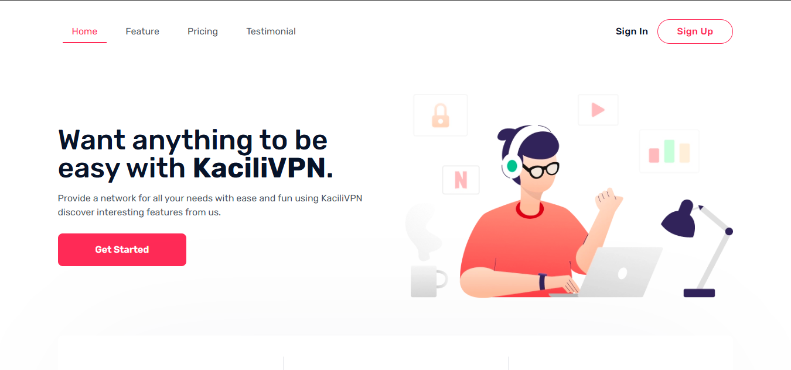

# landing-kacilivpn

Sebuah **landing page (front-end)** untuk proyek VPN dengan nama **KaciliVPN**.  
Template ini akan menjadi halaman muka aplikasi VPN, menampilkan fitur, paket langganan, dan tombol pendaftaran.

---



## 🎯 Tujuan Proyek

- Menyediakan landing page marketing yang menarik dan responsif untuk **KaciliVPN**.  
- Menampilkan fitur VPN (keamanan, kecepatan, privasi) secara visual yang menarik.  
- Mendorong user untuk mendaftar / berlangganan via tombol CTA (Call To Action).  
- Template mudah dikustomisasi and scalable sesuai kebutuhan aplikasi backend.

---

## 📦 Teknologi & Stack yang Direncanakan

- Next.js / React  
- Tailwind CSS / Styled-Components  
- Vercel (deploy) atau Netlify  
- Ikon & ilustrasi dari layanan open source (misalnya Heroicons, Remix Icons)  
- Integrasi form ke backend (API pendaftaran) — belum implementasi

---

## 🛠 Instalasi & Run Lokal

> *Langkah-langkah ini akan kamu isi ketika ada kode*

```bash
git clone https://github.com/oniauliya99/landing-kacilivpn.git
cd landing-kacilivpn

npm install
# atau
yarn install

npm run dev
# atau
yarn dev
